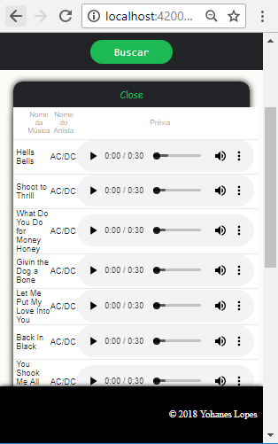

# DesafioSpotify

Esse projeto foi gerado com [Angular CLI](https://github.com/angular/angular-cli) versão 6.0.8.

## Instalando node_modules

Após fazer o clone do projeto, já na pasta raiz do mesmo aplicar o comando no cmd `npm install`

## Servindo a aplicação

Ainda na pasta raiz da aplicação aplicar o comando no cmd `ng serve`. Após subir a aplicação navegar no browser para o caminho `localhost:4200`. A aplicação já iniciara na tela de Login.

## Login

Após clicar em login você será direcionado ao site do spotify para login e aceite de termo de acesso ao seu perfil para utilizarmos de alguns dados de seus favoritos.
Ao fazer Login você será redirecionado para nossa home/apresentação

## Busca por Álbum

Selecione o tipo da pesquisa por Álbum e digite o titulo desejado, após clicar em buscar, será apresentado a lista de Álbuns correspondentes a sua pesquisa!

Ao clicar em alguma imagem de álbum, você conseguirá ver a imagem ampliada!

Ao clicar no nome do álbum você terá acesso do preview da música!!!

Ao clicar no Jóia, favoritará esse álbum no seu perfil! Caso já seja seu favorito ele terá um símbolo de estrela!

## Busca por Artista

Selecione o tipo da pesquisa por Artistas e digite o nome desejado, após clicar em buscar, será apresentado a lista de Artistas correspondentes a sua pesquisa!

Ao clicar na imagem do Artista você verá a imagem ampliada.

Quando o Artista não possui imagem cadastrada no sistema do spotify aparecerá uma imagem indisponível.

Ao clicar no nome do Artista você terá acesso aos cinco últimos álbuns do artista.

## Busca por Música

Selecione o tipo da pesquisa por Músicas e digite o nome desejado, após clicar em buscar, será apresentado a lista de Músicas correspondentes a sua pesquisa!

Ao clicar na imagem do álbum da música correspondente você verá a imagem ampliada.

## Design Responsivo

Todas as páginas tem um layout responsivo se ajustando para tamanhos dimensionados pelo usuário ou quando acessado pelo celular.

Abaixo seguem imagens da página de busca de álbuns.

